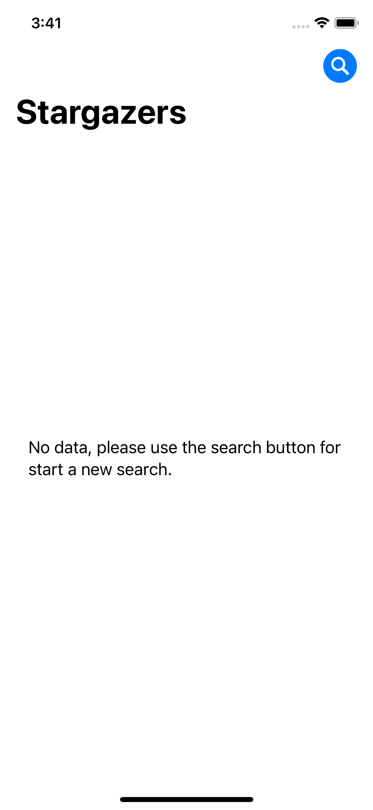
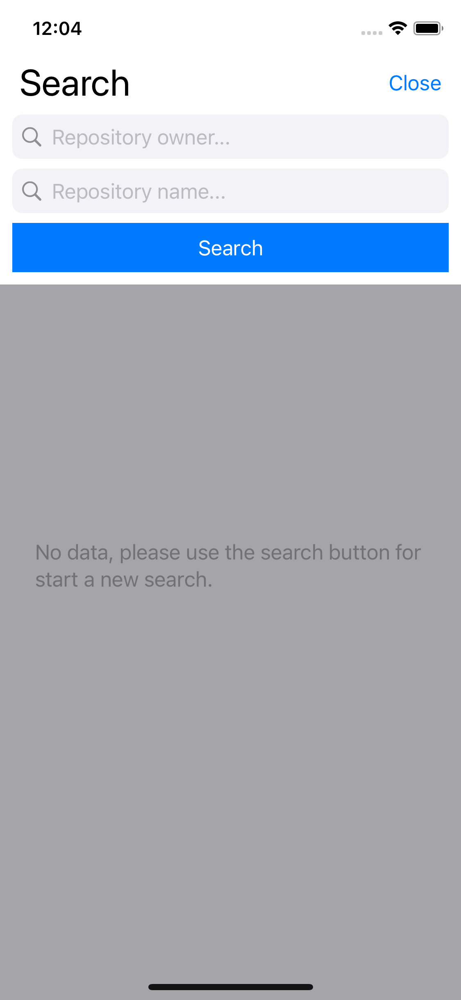
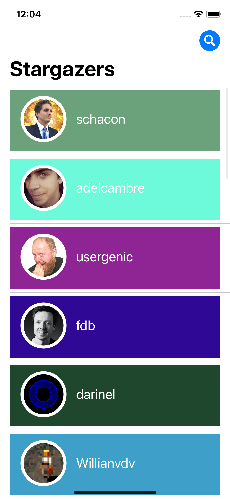

# Stargazers
Simple iOS application that shows the stargazers list of a GitHub repository. It uses the GitHub APIs.

## Technologies
SwiftUI and Combine used in a MVVM architecture.

## Screenshots
<p align="center">



</p>

## Build

This project is full native!
Anyway I added Cocoapods for future implementation so in order to start the App install [CocoaPods](http://cocoapods.org/) and run

```
pod install
```

That's it!

## Requirements

- iOS 13.0
